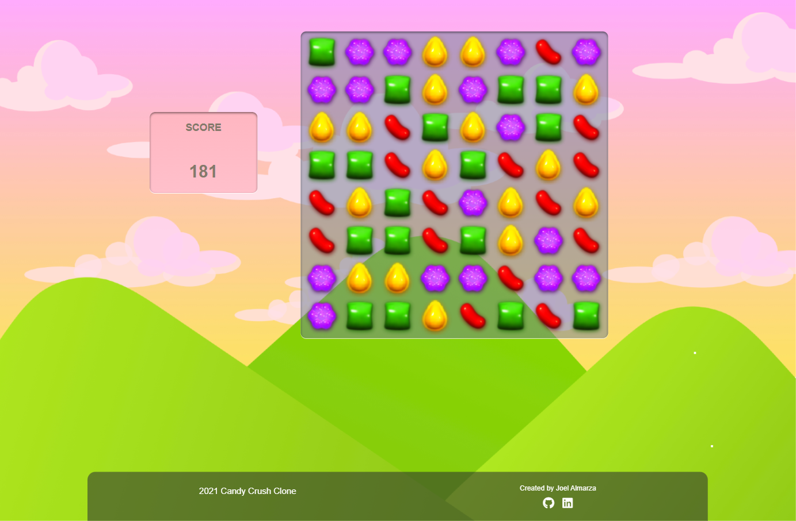
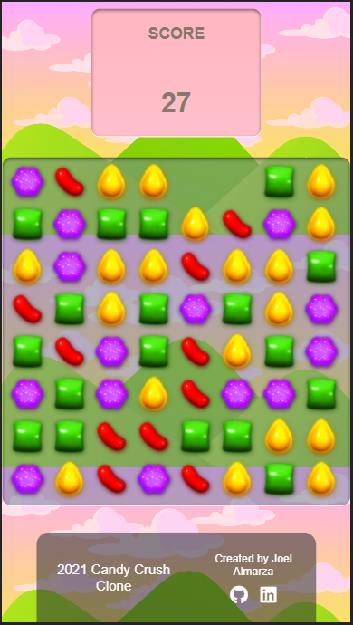

# Candy Crush Clone

This proyect is a simple clone of candy crush buil in vanilla JavaScript, html and css.
No Libraries or frameworks were used to buld the proyect.

## Quick Start 🚀

To run this proyect just need to clone the repository and drop the archives in the public folder of your server.
But if u dont want to clone the repo, here is a [live demo](https://jalmarza98.github.io/CandyCrushClone/).

## Sample Images 📦

Web View            |  Mobile View
:-------------------------:|:-------------------------:
  |  
